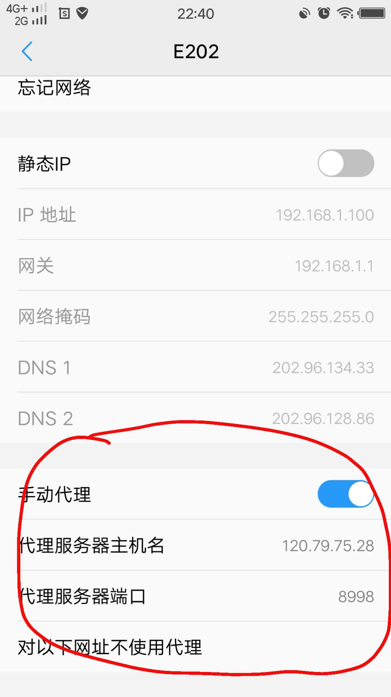
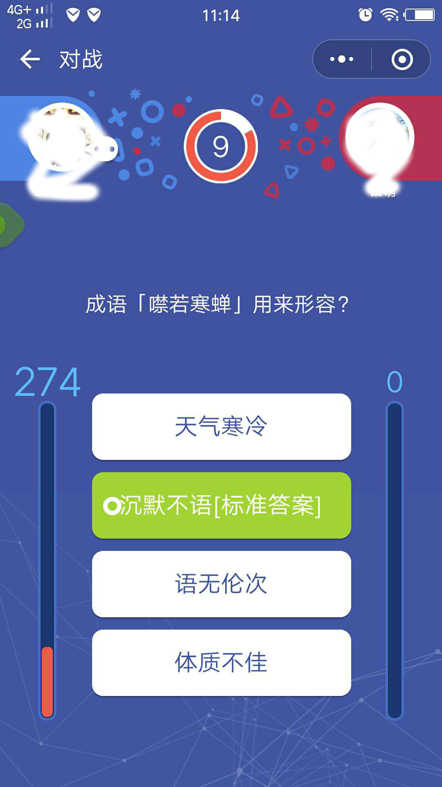
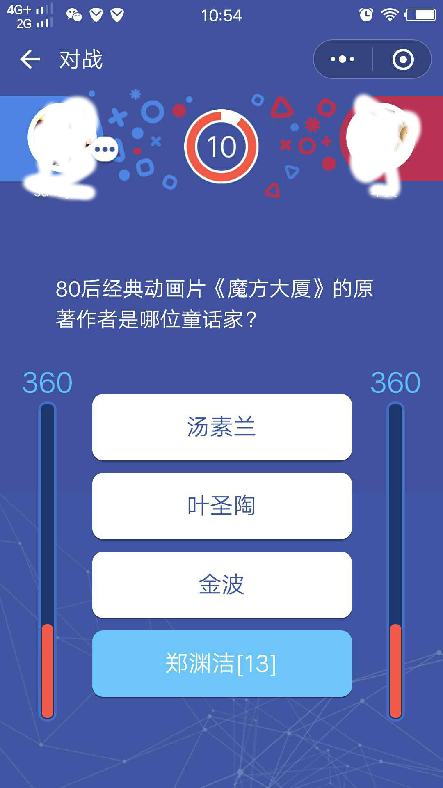
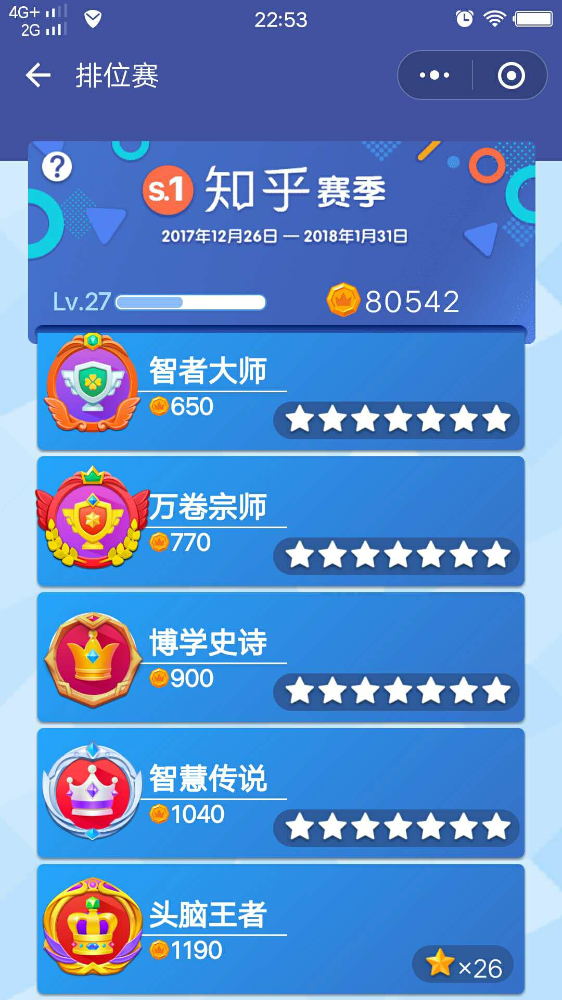

# wechat_brain
小程序王者头脑辅助工具，上万题库。

## 注意
本工具仅供辅助娱乐。

## 使用步骤：
	
1. 安装证书。手机浏览器访问 `abc.com`安装证书,ios记得要信任证书 (或者将 `certs/goproxy.crt`传到手机, 点击安装证书)。
2. 设置手机代理。手机连接wifi后进行代理设置，代理IP为个人pc的ip和端口为8998,移动网络下可通过设置新建APN并在其中设置代理的方式实现。如：

    
 

 

- 注意,第一个图片的host和端口是我的云主机ip端口,你添加证书后可以用这个ip端口测试下, 测试通过后在pc跑起来你的服务后, 将此改为你的电脑ip和端口。

3. 运行主程序。运行方法（二选一）：1）在[release](https://github.com/sundy-li/wechat_brain/releases)页面下载对应的操作系统执行文件, 压缩后, 将`questions.data`文件下载到同一个目录 或 2） 安装go(>=1.8)环境后, clone本repo源码到对应`$GOPATH/src/github.com/sundy-li/`下, 进入源码目录后,执行 `go run cmd/main.go`。
4. 打开微信并启动王者头脑小程序。
5. 正确的答案将在小程序的选项中以【标准答案】或【数字】字样标识。如：  

 
 

## 问题

- 感谢@HsiangHo, @milkmeowo 的贡献,修复了ios代理问题,更新新版本后,最好重新安装证书,重启微信进程
  ~~~ios端由于goproxy无法代理websocket问题,暂时无法使用,希望大家可以来完善这个问题,见[这个issue](https://github.com/sundy-li/wechat_brain/issues/18)~~~

## 合并题库
- 请将questions.data文件压缩为zip文件后提交到[这里](https://github.com/sundy-li/wechat_brain/issues/17), 题库将会定期合并更新。

## 运行示例

    
 

